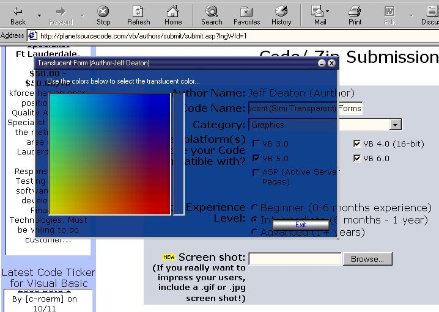

<div align="center">

## A\+\+ Translucent Forms \(See ScreenShot\)


</div>

### Description

This code will show you how to make your VB forms translucent, (or semi-transparent, like glass). The code also utilizes a skin. See the screen shot. If there are any questions, you can post them here or E-Mail me at DEATREE@YAHOO.COM.
 
### More Info
 


<span>             |<span>
---                |---
**Submitted On**   |2000-10-12 09:31:00
**By**             |[Jeff Deaton \(Aurthor\)](https://github.com/Planet-Source-Code/PSCIndex/blob/master/ByAuthor/jeff-deaton-aurthor.md)
**Level**          |Intermediate
**User Rating**    |4.6 (125 globes from 27 users)
**Compatibility**  |VB 6\.0
**Category**       |[Graphics](https://github.com/Planet-Source-Code/PSCIndex/blob/master/ByCategory/graphics__1-46.md)
**World**          |[Visual Basic](https://github.com/Planet-Source-Code/PSCIndex/blob/master/ByWorld/visual-basic.md)
**Archive File**   |[CODE\_UPLOAD1062110122000\.zip](https://github.com/Planet-Source-Code/jeff-deaton-aurthor-a-translucent-forms-see-screenshot__1-12028/archive/master.zip)

### API Declarations

```
ReleaseDC
GetDC
GetDesktopWindow
BitBlt
SendMessage
ReleaseCapture
```


